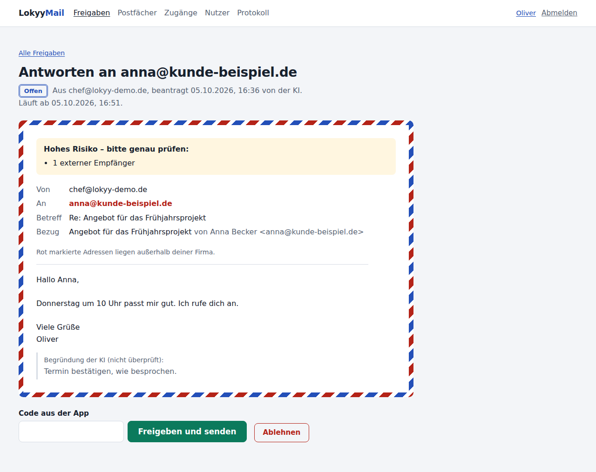

# ✉️ LokyyMail

**Deine KI verwaltet die Postfächer deiner Kunden. Ausgeführt wird nur, was ein Mensch freigibt.**

LokyyMail ist ein selbst gehostetes Mail-Gateway für [Hermes](https://github.com/NousResearch/hermes-agent), Claude und n8n.
Die KI liest, sortiert und **schlägt vor**: Antworten, Weiterleitungen, Aufräumen. Jede Aktion wird ein **Antrag**.
Ein Mensch sieht die exakte Vorschau und gibt frei. Erst dann passiert etwas.

> Status: **v0.3 – Vorabversion.** Siehe [Ehrlicher Stand](#-ehrlicher-stand).



---

## ✨ Was es kann

- 📬 **Google Workspace** (Gmail-API, eigenes Projekt pro Kunde, ohne Google-Prüfverfahren). Microsoft 365 und IMAP folgen.
- ✋ **Freigabe für alles, was schreibt.** Vorschau → Freigabe → erneute Prüfung → Ausführen → Nachprüfen.
- 🚦 **Risiko-Ampel.** Externe Empfänger, Weiterleitungen, Anhänge, Sammelaktionen und verdächtige Mails = hohes Risiko = Zwei-Faktor-Code nötig.
- 🛑 **„Senden komplett aus“** pro Postfach. Dann kann die KI dort nur lesen und aufräumen. Wieder einschalten nur mit Code.
- 🧠 **Prompt-Injection-Schutz.** Versteckter Text wird entfernt, verdächtige Anweisungen erkannt (Deutsch und Englisch), Inhalte als fremde Daten markiert.
- 📎 **Anhänge lesen** (PDF, DOCX, HTML, Text) – mit demselben Schutz.
- 🤖 **MCP-Server** mit 18 Werkzeugen. Keines davon kann freigeben.
- 🖥️ **Hermes-Desktop-Plugin**: Postfach und Freigaben direkt in Hermes.
- 🌐 **Freigabe-Webseite** mit Pflicht-Zwei-Faktor, auch am Handy.
- 👥 **Teams**: Nutzer, Rollen, Postfach-Rechte. Der Betreiber sieht keine Mails.
- 🧾 **Protokoll ohne Mailinhalte**, CSV-Export, Inhalte von Anträgen werden nach Abschluss gelöscht.

## 🧩 So funktioniert's

```
Hermes / Claude / n8n ──MCP (lesen + vorschlagen)──▶ ┌──────────────────────┐ ──▶ Gmail-API
                                                    │  LokyyMail (Coolify)  │
Mensch ──Webseite / Hermes Desktop (freigeben)────▶ │  Freigabe-Engine      │
                                                    └──────────────────────┘
```

## 🚦 Wer darf wo freigeben?

| Aktion | Freigabe-Webseite | Hermes Desktop |
|---|---|---|
| Archivieren, Label, gelesen, Spam, Papierkorb (intern, wenig Risiko) | ✅ | ✅ mit Code |
| Alles mit **hohem Risiko** | ✅ mit Code | ❌ |
| **Senden, Antworten, Weiterleiten** | ✅ (extern: mit Code) | ❌ |

**Warum nicht alles in Hermes?** Hermes läuft in einer Umgebung, die der Agent selbst kontrolliert.
Was das Haus verlässt, gibt man deshalb in einem getrennten Browser frei. Details: [docs/sicherheit.md](docs/sicherheit.md).

## 🚀 Schnellstart (Coolify)

| | Schritt | Anleitung |
|---|---|---|
| 1️⃣ | Google-Projekt beim Kunden anlegen (ca. 15 Min) | [docs/google-workspace.md](docs/google-workspace.md) |
| 2️⃣ | In Coolify deployen, 3 Pflichtwerte eintragen | [docs/coolify.md](docs/coolify.md) |
| 3️⃣ | Admin anlegen, einloggen, Zwei-Faktor einrichten | [docs/coolify.md](docs/coolify.md#3-admin-anlegen) |
| 4️⃣ | Postfach verbinden, KI-Zugriff erlauben | Weboberfläche → Postfächer |
| 5️⃣ | Hermes anbinden (MCP + Plugin) | [docs/hermes.md](docs/hermes.md) |

Zum Ausprobieren ohne Google: `LOKYY_DEMO_MODE=1` → Postfächer → „Demo-Postfach anlegen“. Es enthält eine präparierte Angriffs-Mail samt PDF.

## 🧪 Tests

```bash
pip install -e ".[dev]"
pytest -q          # 56 Tests gegen ein simuliertes Postfach
```

## 🔧 Ehrlicher Stand

- [x] Freigabe-Engine, Risiko-Ampel, Zwei-Faktor, Protokoll – per Tests abgedeckt
- [x] MCP-Server über HTTP getestet (Werkzeuge, Schlüssel-Trennung, Host-Schutz)
- [x] Weboberfläche im Browser geprüft (Desktop, Handy, Hell- und Dunkelmodus)
- [x] Hermes-Plugin: Syntax, Imports und Darstellung gegen ein nachgebautes SDK geprüft
- [ ] Gegen **echtes Google Workspace** getestet
- [ ] **Docker-Build** und Betrieb in **echtem Coolify** getestet
- [ ] Plugin in **echtem Hermes Desktop** getestet
- [ ] Microsoft 365, IMAP (Phase 4), Telegram (Phase 5)

## 📜 Lizenz

Proprietär. © 2026 Oliver Hees aka Aiianer. Nutzung nur mit Lizenzvertrag. Siehe [LICENSE](LICENSE).
